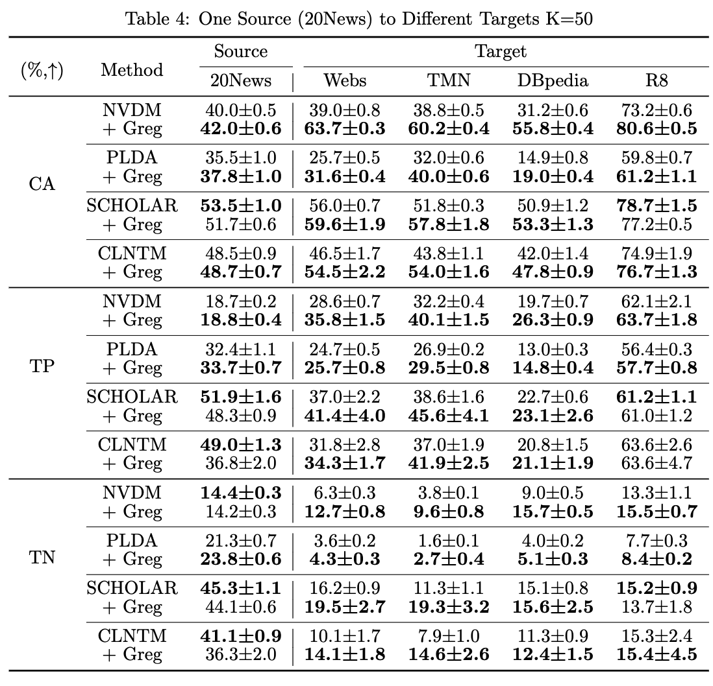

# Topic Model Generalisation
Neural topic model (NTM) generalisation in terms of document representation. 

We propose a Generalisation Regularisation (Greg) term to improve NTMs' generalisation capability in terms of document representation. As a result, an NTM trained on a source corpus still yields good document representation for unseen documents from other corpora.

# Requirements
```python
torch: 2.2.1+cu121
torchmetrics: 1.3.2
numpy: 1.24.1
scipy: 1.12.0
scikit-learn: 1.4.1.post1
gensim: 4.3.2
pot: 0.9.3
tqdm: 4.66.2
```

# Datasets
We use '20News', 'R8', 'Webs', 'TMN' and 'DBpedia' (a random subset), for our experiments. The pre-processed datasets are available for download at: https://drive.google.com/drive/folders/1aNpsTkd95yybj2cXAuwmgshFwBHgv1eF?usp=drive_link

We store our pre-processed datasets in .mat files, which can be loaded as dictionaries using scipy.io.loadmat(). The datasets/dictionaries have the following common attributes/keys:
* wordsTrain, labelsTrain: bag-of-words (BOW) of training documents, and their labels. 
* wordsTest, labelsTest: BOW of testing documents, and their labels.
* vocabulary, embeddings: vocabularies of the corpus, and their word embeddings from 'glove-wiki-gigaword-50'.
* test1, test2: the first and second fold of the test BOWs (for computing document completion perplexity). 

For source-to-target tasks, the source and target data have an extra suffix (e.g. 'wordsTrain_source' and 'wordsTrain_target').

For source-to-noisy tasks, the noisy target is stored in a separate 'data_aug.mat' file.

# Run topic models with Greg
To run original topic models:
```python
python main.py --model NVDM --dataset combined_20News_RestAll --n_topic 50
```

To run topic models with Greg:
```python
python main.py --model NVDM --dataset combined_20News_RestAll --n_topic 50 --use_Greg
```

# Results
We evaluate the document representation quality at every evaluation step (e.g. --eval_step=5). The evaluation is done by document classification and clustering for both source and target documents.

A running example without Greg at epoch 5:
```python
############################################
Evaluation at: 
NVDM_dataset:combined_20News_RestAll_K50_RS1_epochs:5_LR0.0003_reg:False_regW300.0_augRate:0.5_aug:DA2

doc classification acc (original corpus):  0.13582049920339884
doc classification acc (R8):  0.5420195439739414
doc classification acc (DBpedia):  0.11627906976744186
doc classification acc (TMN):  0.2532208588957055
doc classification acc (Webs):  0.2068825910931174
############################################
doc clustering TP, TN (original corpus):  0.14803505045140733 0.08224453123476097
doc clustering TP, TN (R8):  0.5648208469055375 0.0853463317318213
doc clustering TP, TN (DBpedia):  0.15053763440860216 0.052946872286005184
doc clustering TP, TN (TMN):  0.27254601226993863 0.01489680754762807
doc clustering TP, TN (Webs):  0.24898785425101214 0.03753304850686483
############################################
source document completion ppl:  17761.1
############################################
```

A running example with Greg at epoch 5:

Here is one of our results, for 5 runs of 20News as the source, the rest as the targets, where the number of topics for models is set as 50. 
<div style="display: flex; justify-content: center;">
  <div style="margin-right: 10px;">
    
  </div>
  <div style="margin-left: 10px;">
    
  </div>
</div>
Overall, Greg brings significant improvements to the original models in most cases regarding neural topical generalisation.


# Citation 

